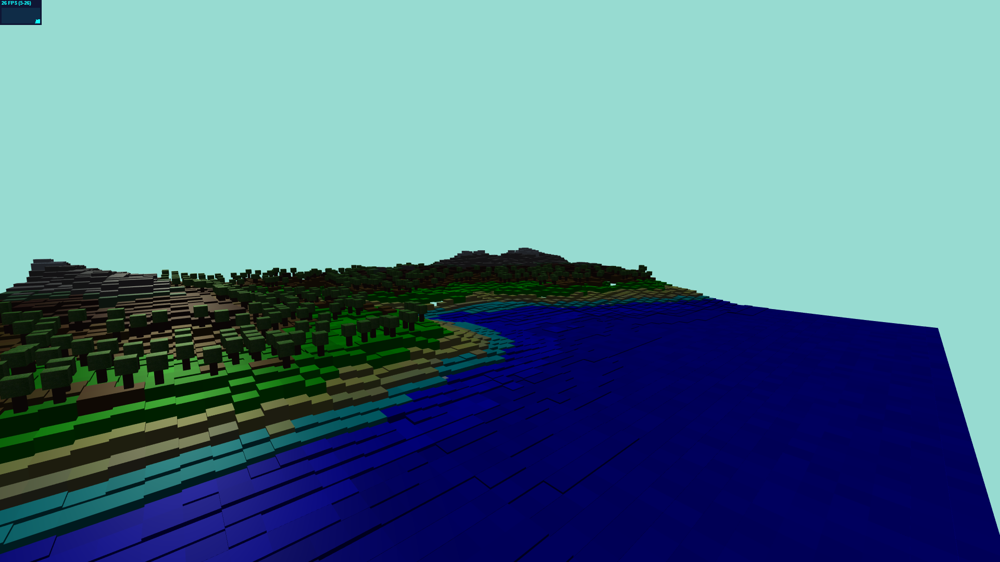

# Cubes Environment

## Riapertura progetto

Il progetto presentato nel file FinalProject.html è una rebuild del progetto sviluppato nella prima metà del corso. Il progetto fa uso di tutte le tecnice acquiste nel primo progetto ma sviluppato in maniera più corretta, semplice, e  pulita in termine di codice e conputazione.

## Terreno

L'immagine scelta per la costruzione del terreno si presta bene per il soggetto che vuole rappresentare, tuttavia sono presenti alcuni punti in cui la differenza di altezza risulta troppo elevata, questo fenomeno viene accentuato dal fatto che per ragioni di costo sono state ridotte le dimensioni dell'immagine.

Originale

Ridotta

La funzione che legge l'array proposto nel codice iniziale è la seguente:

Nella funzione viene richiamato per ogni elemento dell'array buildCube che in base alla posizione del cubo determina il suo colore e l'apparteneza ad una categoria. Le categorie di apparteneza sono necessarie per realizzare le animazioni.

Per supportare il terreno sono stati aggiunti degli alberi in maniera casuale su 2 categorie di cubi.

## Animazioni

Come animazione è stato scelto di aggiungere il movimento delle onde del mare, il movimento della schiuma sulla costa e il movimento della luce.

- Per il movimento delle onde è stata creata la funzione:

	che in ogni istante attribuisce ai cubi appartenti alla categoria "mare", un movimento sinusoidale sull'asse y, con un fattore di variazione dovuto alla loro posizione rispetto all'asse x all'asse.

- Per il movimento della schiuma sono stati realizzati 4 cubi per ogni cubo appartenente alla categoria: "costa", anche a questi è stato attribuito un movimento sinusoidale  
  sull'asse y, ma a differenza delle onde la loro asimmetria è dovuta alla differenza di altezza y in cui sono posizionati. Grazie alla sovrapposizione dei cubi è possibile ottenere un effetto comparsa/scomparsa della schiuma, per evitare conflitto di visualizzazione tra le diverse mesh dovuto alla loro sovrapposizione, i 4 cubi che formano la schiuma non coincidono con la mesh dei cubi che formano la costa.

- Per il moviemento della luce è stato adottato un semplice movimento rotatorio della sorgente luminosa attorno al terreno. Durante la rotazione della sorgente luminosa il colore della luce varia in 3 step se pur minimamente.

Tutti i movimenti si basano su l'angolo denotato dalla variabile globale angle, all'interno della funzione Update necessaria all'aggiornamento della pagina in base al tempo trascorso avviene l'incremento dell'angolo che porta alla modifica della scena.
