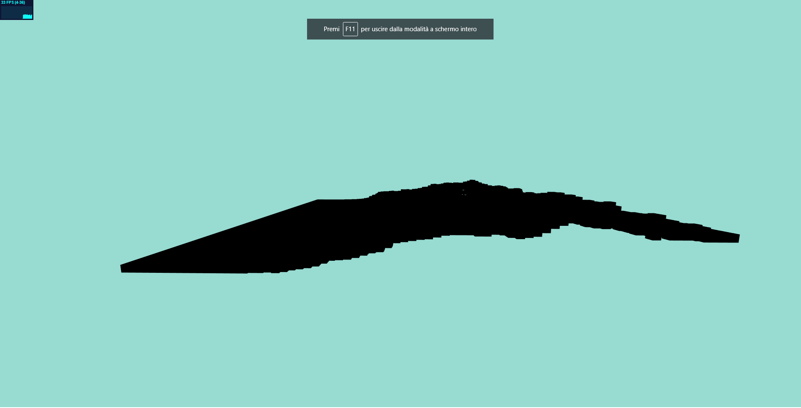
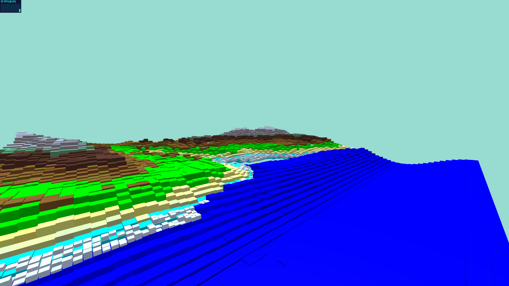
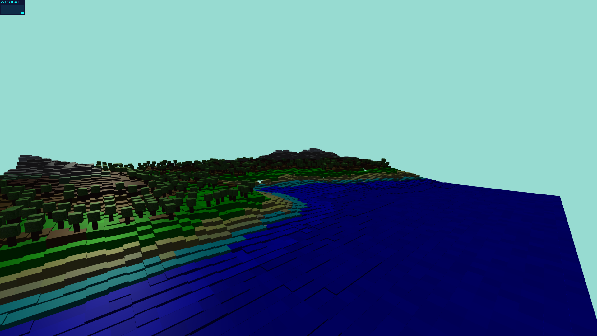

<meta charset="utf-8" emacsmode="-*- markdown -*-">
            **Cubes Project Journal**

8 giugno 2020 - Riapertura progetto presente su Project.html

-------------------------------------------------------------------------------
- Ricerca immagine per l'heightmap del progetto
- Costruzione della funzione per leggere l'heightmap dell'immagine
- Riduzione dell'immagine di partenza.

9 giugno 2020

-------------------------------------------------------------------------------
- Inserimento colori basati sull'altezza del cubo.
- Inserimento oceano in movimento.

10 giugno 2020 -Aggiunta schiuma dell'oceano con animazione

-------------------------------------------------------------------------------

11 giugno 2020

-------------------------------------------------------------------------------
- Miglioramento movimento dell'oceano.
- Aggiunta alberi con textures.    
- Aggiunta luci e animazione delle luci.

